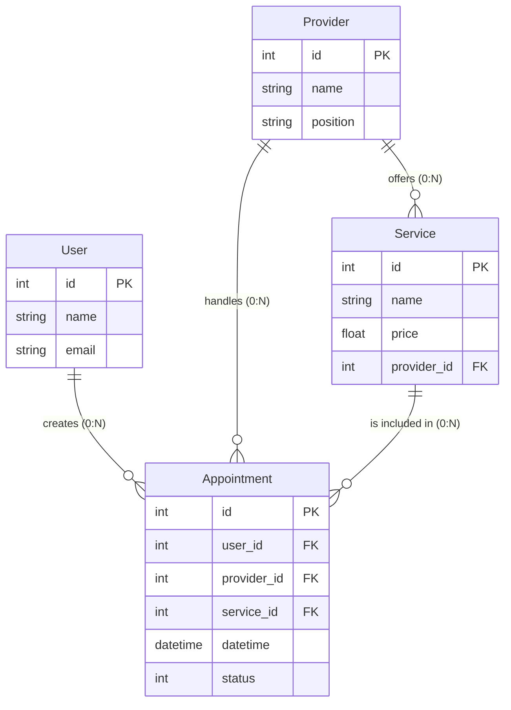

```mermaid
erDiagram

    User {
        int id PK
        string name
        string email
    }

    Provider {
        int id PK
        string name
        string position
    }

    Service {
        int id PK
        string name
        float price
        int provider_id FK
    }

    Appointment {
        int id PK
        int user_id FK
        int provider_id FK
        int service_id FK
        datetime datetime
        int status
    }

    %% Relações

    User ||--o{ Appointment : "creates (0:N)"
    Provider ||--o{ Appointment : "handles (0:N)"
    Provider ||--o{ Service : "offers (0:N)"
    Service ||--o{ Appointment : "is included in (0:N)"
```